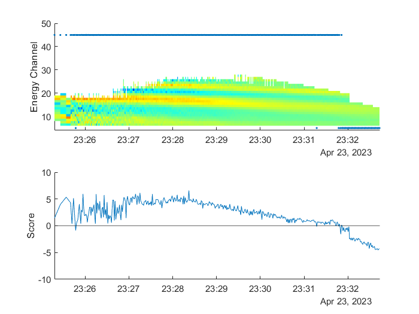
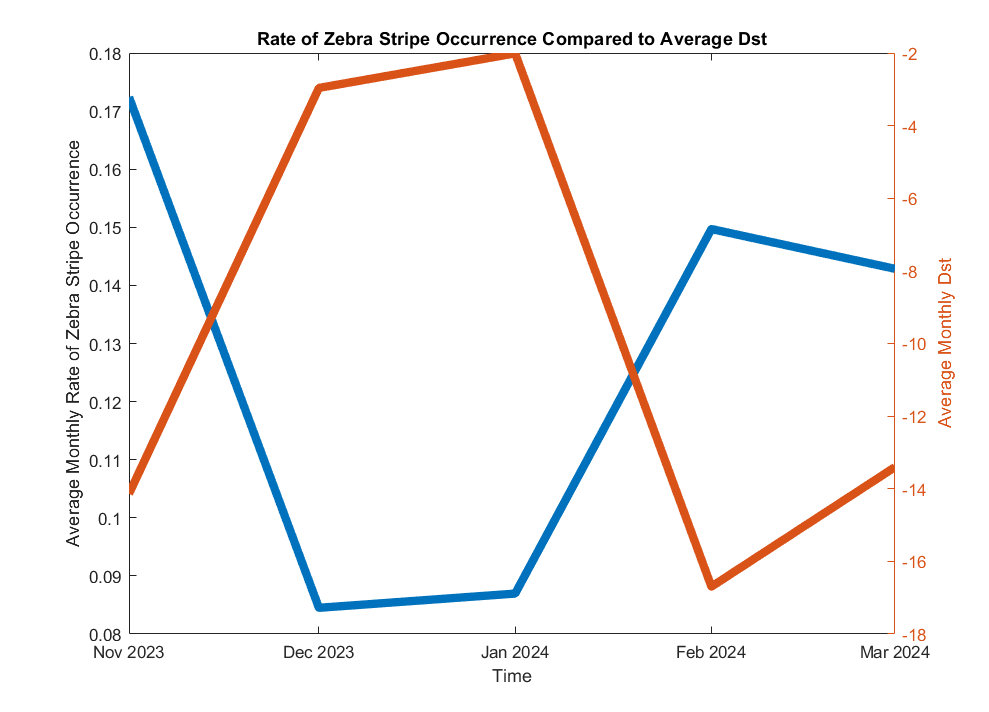

These results were presented at the 2024 American Geophysical Union Annual Meeting.

This is a machine learning algorithm developed to automatically identify relativistic electron "zebra stripes" in the data collected by the Relativistic Electron and Proton Telescope integrated little experiment-2 (REPTile-2) onboard the Colorado Inner Radiation Belt Experiment (CIRBE) spacecraft.

"Zebra stripes" are a feature that can occur in in-situ measurements of electrons in the Van Allen radiation belt, when the data is organized into a spectrogram by particle energy and McIlwain's L parameter at the location of the measurement. It is characterized by successive peaks and troughs in measured electron flux, resulting in "stripes". For more information about this feature, see https://doi.org/10.1029/2024JA033187.

The algorithm was trained on different REPTile-2 passes through the South Atlantic Anomaly (SAA) region, (where the vast majority of electrons are measured as CIRBE is in LEO) that were manually labeled as to whether or not zebra stripes were present. This was done for both passes as a whole, and individual data points within the inner Van Allen belt.

The data that the model was trained on and identified features in was created by converting each column in the spectrogram with electron fluxes sorted by McIlwain's L parameter into a signal. The electron flux is converted to detrended flux, which is the flux minus the average flux, and the energy is converted to drift frequency. The resultant signal is detrended flux as a function of drift frequency. From these signals, several variables are extracted including absolute value, rate of local extrema, maximum and minimum, average difference between data points, etc. The models identify patterns in these variables to determine whether or not they are indicative of zebra stripes.

The model trained using passes as a whole was a K-nearest neighbours model, and it was trained using data from 96 passes, where it achieved an 87.5% correct identification rate. It was then tested on 22 further passes where it achieved an 81.81% correct identification rate.

The model trained using individual data points was a quadratic support vectors model, and it was trained using 2101 data points, where it achieved a 98.1% success rate. It was tested on 726 data points, where it achieved a 96.8% success rate. The following plot shows the "score" of each data point in a pass, where positive values indicate that there are zebra stripes present while negative values indicate there are not any present.

This model was used to determine whether or not the frequency of zebra stripes was related to the average Disturbance storm time (Dst) index, for which lower values correlate to larger disturbances in the Earth's magnetic field. It was determined that from November 2023 to March 2024, the rate of zebra stripe occurrence was exactly inversely correlated with average Dst, indicating that zebra stripes are more likely to occur during active times.

